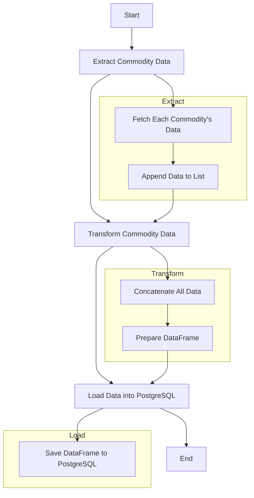




# DBT-Core Project for Commodities Data Warehouse

This project uses **DBT (Data Build Tool)** to manage and transform data in a **Commodities Data Warehouse (DW)**. The goal is to build a robust and efficient data pipeline that processes and organizes commodity data and their movements for analysis.

---

## 📁 Project Structure



---

## 🧾 Components

### 1. Seeds

Seeds are static datasets loaded into the Data Warehouse from CSV files. In this project, seeds are used to load commodity movement data.

### 2. Models

Models define data transformations using SQL and are divided into two main layers:

#### Staging

Responsible for preparing and cleaning data before analysis:

- `stg_commodities.sql`: Cleans and formats commodity data from the API.
- `stg_movimentacao_commodities.sql`: Cleans and formats commodity movement data.

#### Datamart

Final layer containing analysis-ready data:

- `dm_commodities.sql`: Integrates commodity and movement data to create the final model.

### 3. Sources

Sources are the raw tables or files DBT reads from to perform transformations.

### 4. Snapshots

Snapshots are used to maintain historical changes in the data over time.

---

## 📂 Directory Structure

```plaintext
├── models
│   ├── staging
│   │   ├── stg_commodities.sql
│   │   └── stg_movimentacao_commodities.sql
│   └── datamart
│       └── dm_commodities.sql
├── seeds
│   └── movimentacao_commodities.csv
├── dbt_project.yml
└── README.md
```

---

## 🚀 Running the Project

### Requirements

- Python 3.7+
- DBT

### Setup Steps

1. **Clone the Repository**
   ```bash
   git clone <repository-url>
   cd <repository-folder>
   ```

2. **Install DBT**
   ```bash
   pip install dbt-core dbt-postgres
   ```

3. **Configure DBT**
   Create or update `profiles.yml` (location: `~/.dbt/` or path defined by `DBT_PROFILES_DIR`):

   ```yaml
   databasesales:
     target: dev
     outputs:
       dev:
         type: postgres
         host: <DB_HOST_PROD>
         user: <DB_USER_PROD>
         password: <DB_PASS_PROD>
         port: <DB_PORT_PROD>
         dbname: <DB_NAME_PROD>
         schema: <DB_SCHEMA_PROD>
         threads: 1
   ```

4. **Run Seeds**
   ```bash
   dbt seed
   ```

5. **Run Transformations**
   ```bash
   dbt run
   ```

6. **Run Tests**
   ```bash
   dbt test
   ```

---

## 🤝 Contribution

To contribute to this project:

1. Fork the repository.
2. Create a new branch.
3. Submit a pull request with your changes.

---

## 📘 Model Descriptions

### `stg_commodities.sql`

Handles cleaning and formatting of commodity data extracted from the API. Prepares data for the datamart layer.

### `stg_movimentacao_commodities.sql`

Handles cleaning and formatting of commodity movement data. Prepares it for the datamart layer.

### `dm_commodities.sql`

Combines cleaned commodity and movement data. Builds the final dataset used in dashboards and analytics, including metrics and aggregations.


